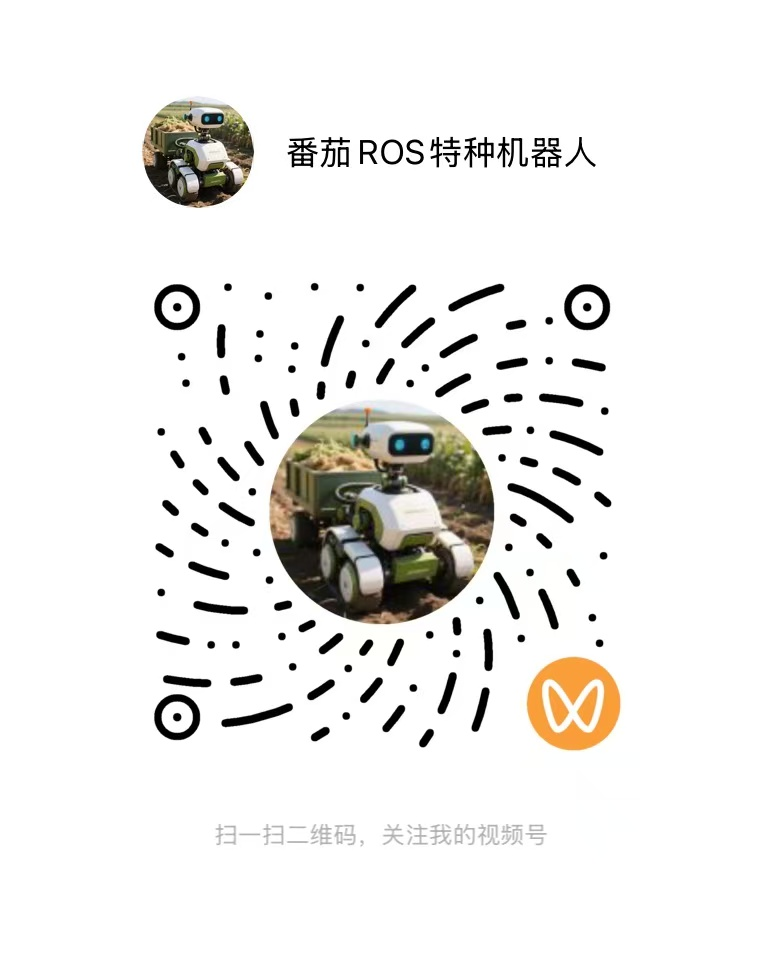

# autoware-documentation-cn

autoware-documentation 文档, 基于 [autoware-documentation](https://github.com/autowarefoundation/autoware-documentation) 进行翻译.

- [英文文档(原版)](https://autowarefoundation.github.io/autoware-documentation/main/home/)
- [中文文档(当前)](https://tomato-ros.github.io/autoware-documentation-cn/)

## 关于作者

公众号《番茄ROS机器人》作者，长期致力于 ROS2 与 Autoware 框架下的低速无人驾驶解决方案研发，专注技术实战与经验沉淀，分享低速无人系统开发中的技术难点、解决方案与行业思考，与开发者共同推动低速无人驾驶技术的落地与创新。

## 关注作者

### 公众号

### 视频号

